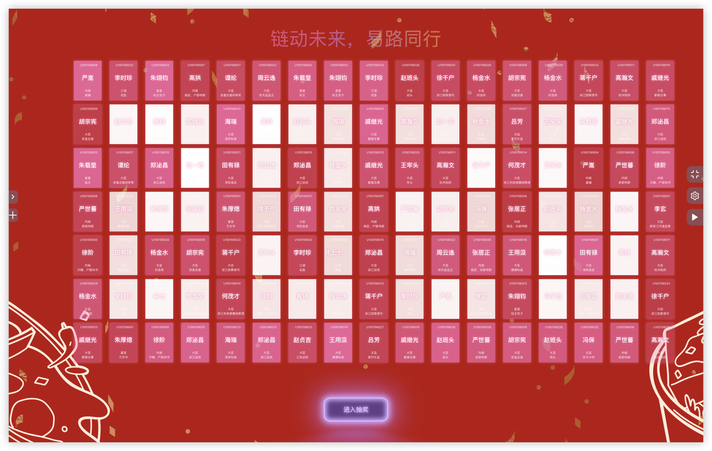
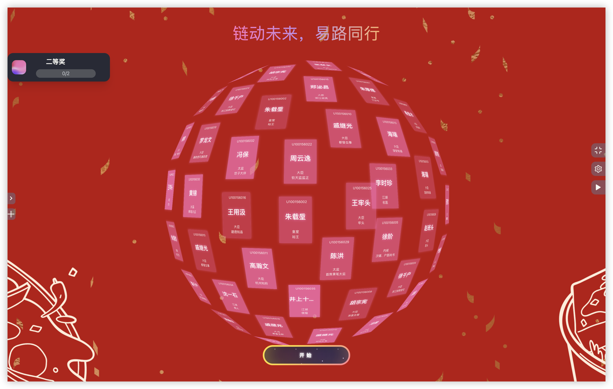
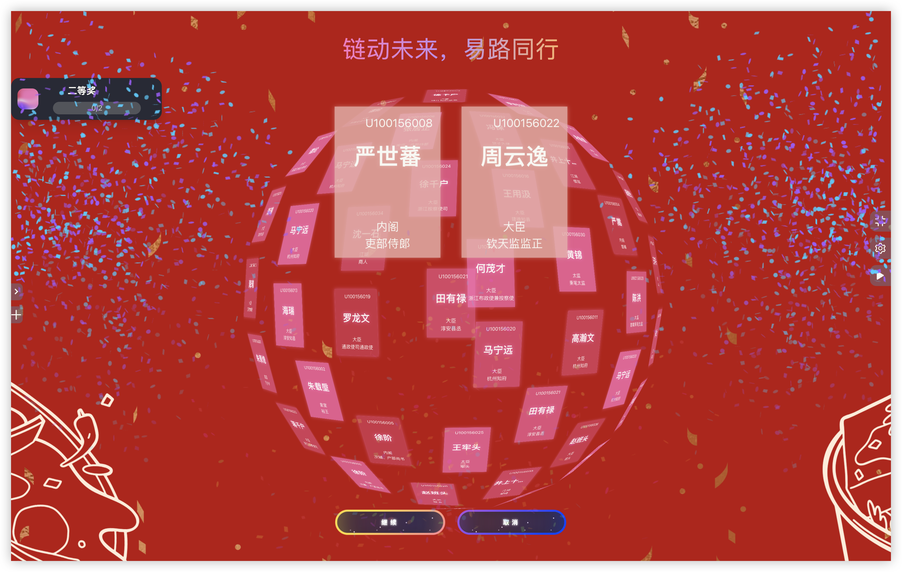
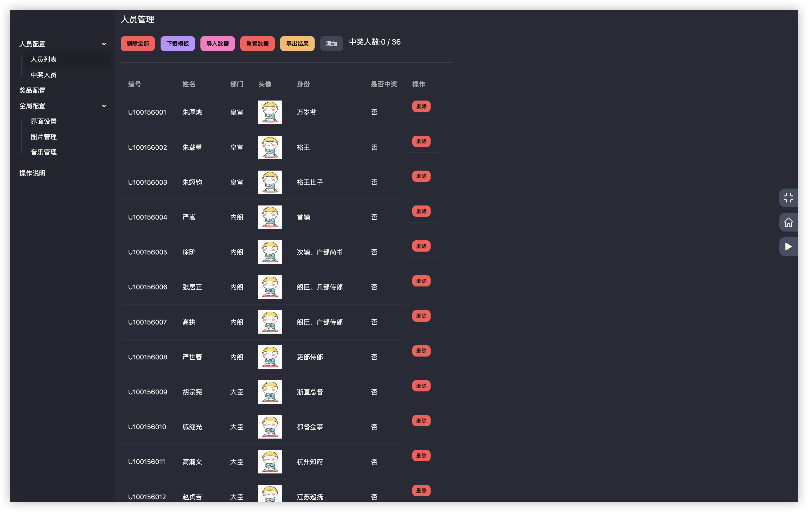
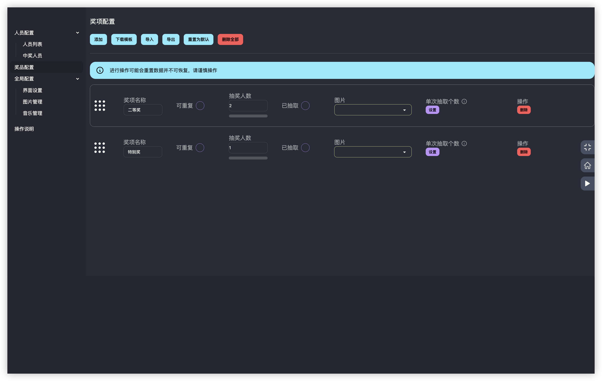
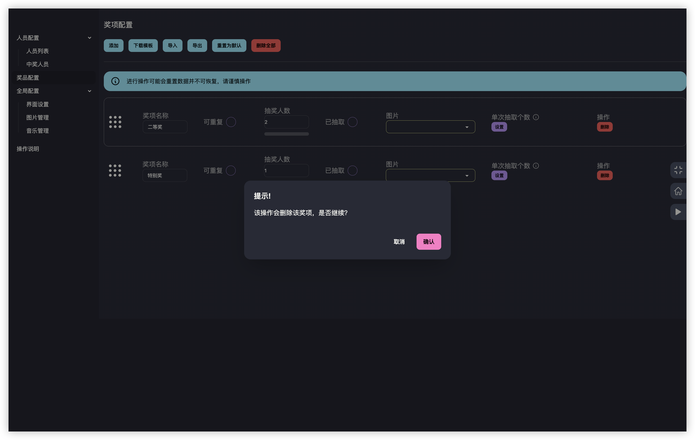
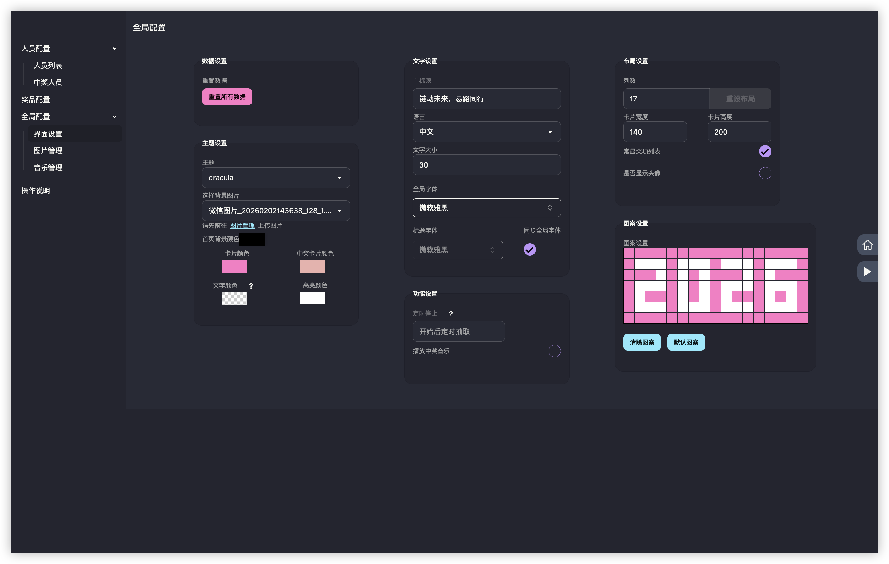

<div align="center">
    <a href="https://lottery.zzio.de/log-lottery">
        
    </a>

# log-lottery

[](https://github.com/s1xu/log-lottery)
[](https://github.com/s1xu/log-lottery)
[](https://github.com/s1xu/log-lottery)
[](https://github.com/s1xu/log-lottery/commits/)

> Fork 自 [LOG1997/log-lottery](https://github.com/LOG1997/log-lottery)，感谢原作者的出色工作！

</div>

log-lottery 是一个可配置可定制化的抽奖应用，炫酷 3D 球体，可用于年会抽奖等活动，支持奖品、人员、界面、图片音乐配置。

> 如果进入网站遇到图片无法显示或有报错的情况，请先到【全局配置】-【界面配置】菜单中点击【重置所有数据】按钮清除数据后进行更新。

## 访问地址

使用 PC 端最新版 Chrome 或 Edge 浏览器访问：

[lottery](https://lottery.zzio.de/log-lottery)

## 相对于上游的个性化改进

### 功能增强
- ✨ 奖项配置支持 Excel 导入导出
- ✨ 首页新增当前奖品卡片展示和跑马灯效果
- ✨ 首页背景颜色可配置
- ✨ 左侧奖品列表超长时自动滚动动画

### 交互优化
- 🎯 奖项删除增加二次确认
- 🎯 取消抽奖增加二次确认
- 🎯 左侧奖品列表默认隐藏，操作按钮始终显示
- 🎯 临时抽奖弹窗按钮样式优化
- 🎯 已中奖人员按时间倒序展示

### Bug 修复
- 🐛 修复 Windows 下 3D 卡片渲染模糊问题
- 🐛 修复奖品卡片图片不响应数据变化
- 🐛 修复删除奖项后数据未同步更新
- 🐛 修复首页奖项列表收起动画不流畅

...
需要更多功能或发现bug请留言[issues](https://github.com/s1xu/log-lottery/issues)

## 详细介绍

### 配置参与人员

于人员配置管理界面下载excel模板，按要求填好数据后导入即可。

### 配置奖项

于奖项配置管理界面添加奖项后，自定义修改名称、抽取人数、是否全员参加、图片显示。

### 界面配置

可自定义配置标题、列数、卡片颜色、首页图案等。

### 图片和音乐管理

上传图片或音乐即可，数据使用indexdb在浏览器本地进行存储。

## 预览

首页
<div align="center">
    
</div>

抽奖
<div align="center">
    
    
</div>

配置
<div align="center">
    
    
    
    
</div>

图片音乐配置

## 技术

- vue3
- threejs
- indexdb
- pinia
- daisyui

## 开发

安装依赖

```bash
pnpm i
or
npm install
```

开发运行

```bash
pnpm dev
or
npm run dev
```

打包

```bash
pnpm build
or
npm run build
```

> 项目思路来源于 <https://github.com/moshang-xc/lottery>


## 支持项目

如果觉得本项目有帮助，欢迎 Star 支持！

同时也请支持原作者 [LOG1997](https://github.com/LOG1997/log-lottery)。

## License

[MIT](http://opensource.org/licenses/MIT)
